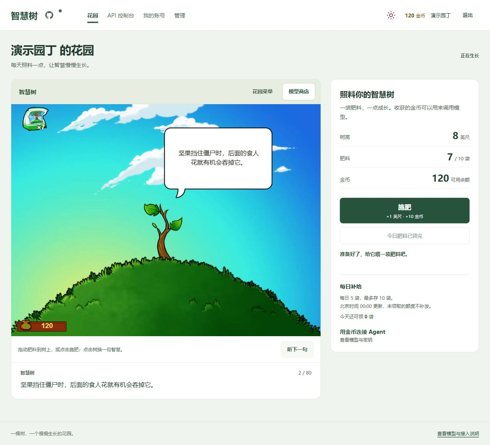
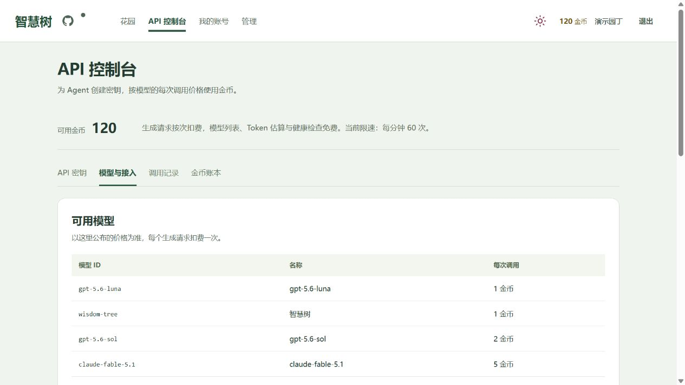
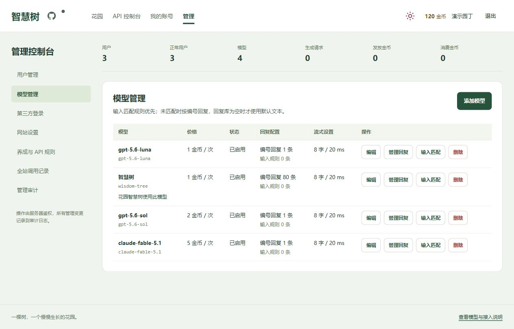
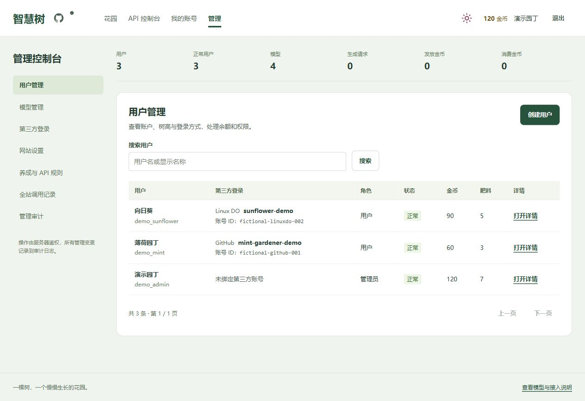
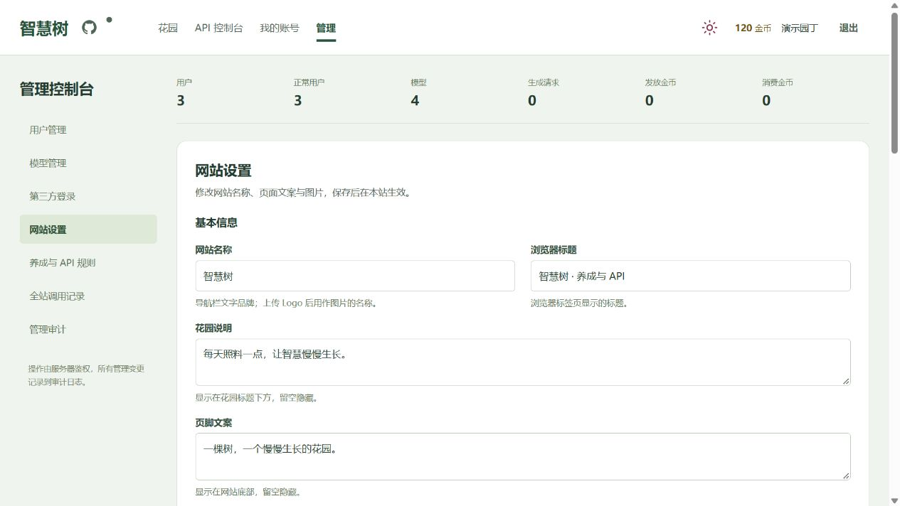
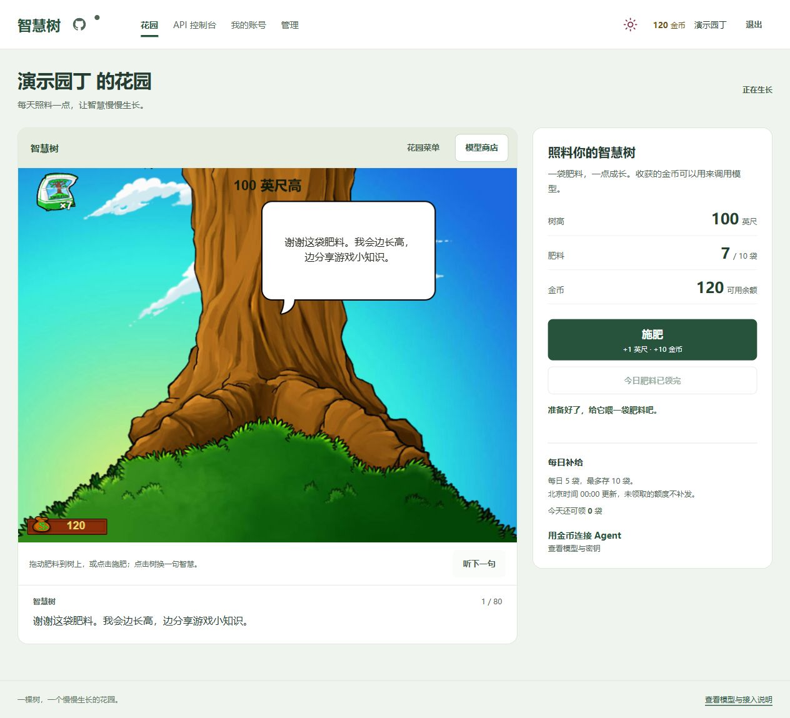

<div align="center">

<h1>🌱 智慧树</h1>

<p><b>种下一棵树，把每天的照料变成金币。</b><br>再用金币，给你的 Agent 一个会回话的模拟 API。</p>

<p>
  <a href="https://github.com/vow132/wisdom-tree/actions/workflows/cd.yml"></a>
  <a href="https://github.com/vow132/wisdom-tree/stargazers"></a>
  <a href="LICENSE"></a>
</p>
<p>
  <a href="https://react.dev/"></a>
  <a href="https://www.typescriptlang.org/"></a>
  <a href="https://fastify.dev/"></a>
  <a href="https://www.postgresql.org/"></a>
  <a href="https://docs.docker.com/compose/"></a>
</p>

<p><a href="https://ai.91i.asia">在线体验</a> · <a href="#docker-部署">快速部署</a> · <a href="docs/deployment.md">部署指南</a> · <a href="docs/agent-integration.md">Agent 接入</a> · <a href="#文档导航">全部文档</a></p>

</div>

原版《植物大战僵尸》智慧树的网页养成体验，加上金币经济、兼容 OpenAI / Anthropic 的假 AI API 和管理后台。拖一袋肥料到树上，看它长高，再把收获的金币用在 API 调用上。

**模型返回管理员配置的文字或 ASCII，支持 JSON 与 SSE 流式输出，不连接真实模型推理。** 可用于体验养成、演示接口，以及验证 SDK 和 Agent 的连接与响应解析。模型名称仅是模拟服务的标识。

[](docs/screenshots/garden.jpg)

## 一眼看懂

**空花盆 → 登录领种子 → 播种 → 每日领肥料 → 施肥长高、收金币 → 用金币调用 API**

| 功能 | 你可以做什么 |
| --- | --- |
| 🌳 智慧树养成 | 原版场景与 Canvas 动画；拖放或点击施肥，成功后直接更新树高、肥料和金币，无需刷新、无需轮询 |
| 💬 可配置的回复 | 设置“你好 → 你好”的指定回复；未匹配时轮换编号回复，空库时使用默认文本；可调整流式速度 |
| 🔌 SDK / Agent 接入 | 使用 OpenAI Chat Completions、Completions、Responses 或 Anthropic Messages；支持普通与流式回复 |
| 🔑 账户与密钥 | 账号密码、GitHub、Linux DO 登录与主动绑定；自己的 `sk_` 密钥可随时查看、复制或撤销 |
| 🛠️ 管理后台 | 管理用户、角色、金币、肥料、模型 ID 与价格；查看第三方绑定，支持封禁、解封、当前页全选与批量操作，保护最后一位有效管理员 |
| 🎨 网站设置 | 修改名称、浏览器标题、花园与页脚文案，上传 Logo、图标和背景；在同一页面配置网站更新 |
| 📦 部署与运维 | Docker Compose + PostgreSQL + Caddy HTTPS；GitHub Actions 测试与发布；配套数据库、配置和图片备份 |

支持浅色、深色和随系统主题，手机按场景比例缩放，鼠标与触摸均可操作。养成数据由服务器保存，重复点击和并发请求通过事务与幂等处理。

## 界面预览

以下截图取自独立的本地演示环境，账户、第三方绑定、树高与余额均为演示数据。**点击图片可查看完整页面。**

| API 控制台 | 模型管理 |
| :---: | :---: |
| [](docs/screenshots/api-console.jpg) | [](docs/screenshots/admin-models.jpg) |
| 查看模型价格，复制 SDK / Agent 接入地址 | 编辑模型 ID、按次价格、回复与输入匹配 |

| 用户管理 | 网站设置 |
| :---: | :---: |
| [](docs/screenshots/admin-users.jpg) | [](docs/screenshots/site-settings.jpg) |
| 查看绑定身份，多选后批量封禁、解封或彻底删除 | 修改文案与图片，配置 GitHub 网站更新 |

<details>
<summary>🌲 看看长到 100 英尺的智慧树</summary>

[](docs/screenshots/garden-grown.jpg)

原版成熟树素材有画面大小上限，达到该阶段后仍可继续增加英尺数并获得金币。

</details>

## 养成规则

| 每日肥料 | 库存上限 | 每次施肥成长 | 每次施肥奖励 |
| :---: | :---: | :---: | :---: |
| 5 袋 | 10 袋 | +1 英尺 | +10 金币 |

每日额度在**北京时间 00:00** 刷新，不补领往日额度。库存满时可以先施肥，再领取当天剩余部分。每个账户只能领取、种植一棵树；点击树或“听下一句”可免费换一句智慧树对白。

初始智慧树有 **80 条**中文玩法事实摘要与原创闲聊，后台可编辑。它们不是原版逐字台词或官方中文翻译，完整来源与索引见 [智慧树语料](docs/wisdom-corpus.md)。管理员修改规则后，后续操作使用新设置。

## Docker 部署

Linux 服务器准备 Docker Engine 和 Compose 插件，将域名解析到服务器，开放 80 / 443 端口。

```bash
git clone https://github.com/vow132/wisdom-tree.git
cd wisdom-tree
cp .env.example .env
# 填好 .env 中的必填项后启动
docker compose up -d --build
docker compose exec -T api node dist/admin-cli.js
```

| 必填环境变量 | 用途 / 示例 |
| --- | --- |
| `SITE_ADDRESS` | 网站域名，例如 `tree.example.com` |
| `PUBLIC_ORIGIN` | 浏览器访问地址，例如 `https://tree.example.com` |
| `POSTGRES_PASSWORD` | 数据库长随机密码；连接 URL 中的特殊字符需要编码 |
| `ADMIN_PASSWORD` | 首次初始化管理员的密码；初始化后可清除并重建 API 服务 |
| `API_KEY_ENCRYPTION_KEY` | 持久的 64 位十六进制主密钥，用 `openssl rand -hex 32` 生成 |

Caddy 自动申请 HTTPS 证书，启动时自动执行数据库迁移。数据库、上传图片与证书使用持久卷；PostgreSQL 与后端端口不暴露到公网。

**小服务器建议使用 CI 构建的镜像。** GitHub Actions 先测试，再构建发布、验证完整 Docker 栈，最后通过 SSH 部署；服务器无需编译项目。独立部署所需的仓库变量、Secrets 和回滚流程见 [CI/CD 部署指南](docs/deployment.md)。

备份用 `bash scripts/backup.sh`。同一份数据库 `.dump`、配置 `.env` 和图片 `.uploads.tar.gz` 必须一起保管，恢复时保留原 `API_KEY_ENCRYPTION_KEY`。恢复命令与图片处理见 [备份恢复](docs/site-assets-backup.md)。

## 登录与网站配置

管理员登录后可直接在后台完成配置：

| 后台入口 | 可配置内容 |
| --- | --- |
| 第三方登录 | GitHub / Linux DO 的启用开关、Client ID、Client Secret 与回调地址；未开启的方式不显示在登录页 |
| 网站设置 | 网站名称、浏览器标题、花园说明、页脚文案；Logo、图标、背景上传与恢复默认 |
| 网站设置 → 网站更新 | 配置专用 GitHub Token；绿点表示版本一致，黄点表示有更新，管理员点击黄点触发已有 CI/CD |
| 养成与 API 规则 | 每日肥料、库存上限、施肥奖励、成长增量与接口限流 |

第三方登录默认采用平台昵称；已有账户可以主动绑定身份，共享同一棵树和金币。系统不按同名或邮箱自动合并账户，后台用户列表会显示绑定的平台、昵称和第三方 ID。OAuth Secret 和更新 Token 加密保存，后台不回显。

用户列表支持单选、多选和**当前页全选**，可一次封禁、解封或彻底删除选中账户。搜索或翻页会清空选择。封禁立即使登录会话失效并阻止 API 调用；解封后需重新登录。删除会移除账户、智慧树、金币、肥料、第三方绑定、密钥、调用记录及账本，不能在后台恢复。批量请求在一个事务中处理，整批成功或整批回滚；升级也会清理历史软删除用户。模型仍采用软删除以保留模型历史。

图片支持不超过 **2 MB** 的静态 PNG、JPEG、WebP，选择后先预览，上传后保存。文案与图片保存成功后直接更新当前页面；网站配置与更新状态均不轮询。详见 [第三方登录](docs/oauth-login.md)、[网站设置](docs/site-settings.md) 和 [网站更新](docs/website-updates.md)。

## API 与 Agent 接入

登录后在 **API 控制台 → API 密钥** 创建自己的 `sk_` 密钥，可随时查看明文、一键复制或撤销。数据库使用摘要鉴权、加密保存可恢复值；管理员只能看到标识。

| 协议 / 功能 | 接口 |
| --- | --- |
| OpenAI Chat Completions | `/v1/chat/completions` |
| OpenAI Completions | `/v1/completions` |
| OpenAI Responses | `/v1/responses` |
| Anthropic Messages | `/v1/messages` |
| 免费查询 | `/v1/models`、`/v1/messages/count_tokens`、`/health` |

OpenAI Base URL 为 `https://你的域名/v1`；Anthropic Base URL 为 `https://你的域名`。以下为 OpenAI JavaScript SDK 示例，密钥从环境变量读取：

```js
import OpenAI from 'openai';
import { randomUUID } from 'node:crypto';

const client = new OpenAI({
  baseURL: 'https://你的域名/v1',
  apiKey: process.env.WISDOM_TREE_API_KEY,
});
const requestKey = randomUUID(); // 同一次操作重试时保留这个值和原请求体
const response = await client.responses.create({
  model: 'gpt-5.6-luna',
  input: '你好',
  max_output_tokens: 1024,
}, { headers: { 'Idempotency-Key': requestKey } });
console.log(response.output_text);
```

在你的客户端项目中安装 `openai`，设置 `WISDOM_TREE_API_KEY` 并替换域名后运行。Codex、Claude Code、Anthropic SDK 与流式调用的示例见 [Agent 接入指南](docs/agent-integration.md)。管理员修改模型 ID 后，客户端也需同步修改。

### 默认模型与计费

| 初始模型 ID | 金币 / 次 | 默认回复 |
| --- | ---: | --- |
| `gpt-5.6-luna` | 1 | 鸡蛋 ASCII 与仓库文案 |
| `gpt-5.6-sol` | 2 | 鸡蛋 ASCII 与仓库文案 |
| `claude-fable-5.1` | 5 | 鸡蛋 ASCII 与仓库文案 |
| `wisdom-tree` | 1 | 80 条智慧树语料，按编号轮换 |

全新数据库自动导入这套公开配置，包含回复库；运行中的价格与 ID 以网站公布为准。配置文件与导入方式见 [默认数据库](docs/default-database.md)。

生成请求通过校验并被数据库事务接受后，按模型固定价格扣一次金币。接受前失败免费；接受后断流仍计一次。模型查询、Token 估算和健康检查免费，Token 数仅为估算，不参与金币计价。

重试时复用 `Idempotency-Key` 并保持原请求体，会返回保存的回复，不重复扣费或推进回复位置；同一 Key 携带不同请求体返回 `409`。并发扣费使用事务处理，防止负余额。

## 开发与验证

前端使用 **React 19 + TypeScript + Vite + Canvas 2D**，后端使用 **Fastify 5 + PostgreSQL 17**。面向普通 2 核 2 GB 服务器，动画由浏览器绘制，服务端处理状态与固定回复；实际并发容量仍需按使用量测试。

```bash
npm run typecheck
npm run build
npm test
```

| 目录 | 内容 |
| --- | --- |
| `frontend/` | 花园、API 控制台、账户与管理后台 |
| `backend/` | 登录、养成、账本、模拟协议与管理接口 |
| `backend/migrations/` | PostgreSQL 数据库迁移 |
| `backend/data/` | 公开默认模型、回复与智慧树语料 |
| `scripts/` | 预览、部署、备份与恢复工具 |
| `docs/` | 接入、运维、来源与验收记录 |

集成测试覆盖登录、OAuth 模拟、并发养成与计费、幂等重放、断流、管理员保护、网站配置与图片处理，以及官方 SDK 的 JSON / SSE 解析。Docker 验证包含 Caddy 代理、真实图片上传与重建后持久性；具体范围见 [CI 说明](docs/ci.md) 和 [验收记录](docs/qa-acceptance.md)。

## 文档导航

| 想了解什么 | 从这里开始 |
| --- | --- |
| 部署、CI/CD 与回滚 | [部署指南](docs/deployment.md) · [CI 检查](docs/ci.md) |
| SDK / Agent 与协议细节 | [Agent 接入](docs/agent-integration.md) · [API 契约](docs/api-contract.md) |
| OAuth 登录与账号绑定 | [第三方登录说明](docs/oauth-login.md) |
| 网站文案、图片与版本更新 | [网站设置](docs/site-settings.md) · [网站更新](docs/website-updates.md) |
| 数据库、图片与配置恢复 | [备份恢复](docs/site-assets-backup.md) · [默认数据库](docs/default-database.md) |
| 原版素材与智慧树语料 | [素材来源](docs/assets.md) · [语料核验](docs/wisdom-corpus.md) |
| 验收与公开仓库检查 | [验收记录](docs/qa-acceptance.md) · [设计核验](design-qa.md) · [仓库审计](docs/repository-audit.md) |

## 致谢与许可

项目代码采用 [MIT License](LICENSE)。原版游戏素材的权利归原权利人所有，来源与使用说明见 [素材说明](docs/assets.md)。

模拟 API 的思路参考 [fake-ai-api](https://github.com/XTxiaoting14332/fake-ai-api)；页面顶部徽章由 [Shields.io](https://shields.io/) 生成。

## 🔗 友情链接

[LINUX DO](https://linux.do/) —— 真诚分享、友好讨论的技术社区，本项目的交流与反馈也发布于此
